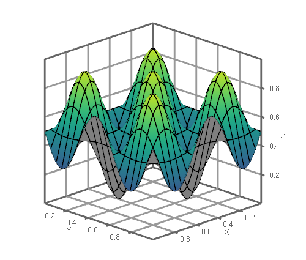
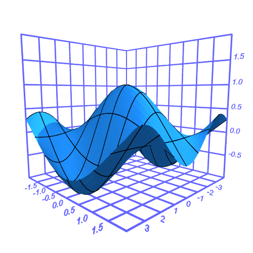

# genpy3d

3d graph plotting with opengl and povray.

These are experimental modules that I hope to fully develop later and add into generativepy.

The code basically works, but at the moment the unit tests might fail due to the source code being gathered from other repos and possibly not bring in the right folders. There are also some system dependencies, mainly that opengl and povray need to be installed.

## OpenGL example

## Povray example

